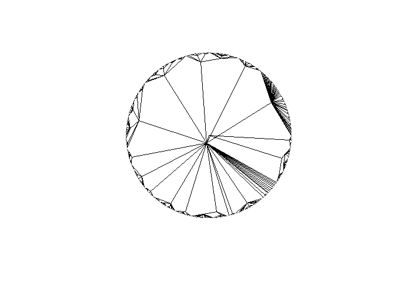

<!-- README.md is generated from README.Rmd. Please edit that file -->

# geotax

<!-- badges: start -->
<!-- badges: end -->

This packages aims to model the probability that two host share a
pathogen given a phylogenetic (or taxonomic) distance. Please link to
the original [paper](https://doi.org/10.3389/fams.2017.00017)

## Installation

You can install the development version of geotax from
[GitHub](https://github.com/alrobles/geotax) with:

``` r
# install.packages("devtools")
devtools::install_github("alrobles/geotax")
```

## Examples

geotax comes with basic tools. For example compute a taxonomic tree from
a table with taxonomic ranks. In this example we load a taxonomic tree
of species that has been record with bark beetles. We use the table
provide in the paper.

We can also plot this tree and explore the distance matrix with the help
of ape package

``` r
library(geotax)
library(dplyr) ## this is for clean the data if need it
#> Warning: package 'dplyr' was built under R version 4.1.3
#> 
#> Attaching package: 'dplyr'
#> The following objects are masked from 'package:stats':
#> 
#>     filter, lag
#> The following objects are masked from 'package:base':
#> 
#>     intersect, setdiff, setequal, union
data("tax_table")
clean_tree <- distinct(tax_table)

# clean the data
taxonomic_tree <- geotax::get_taxonomical_tree(clean_tree, power = 1)
plot(taxonomic_tree, type = "radial", show.tip.label = FALSE)
```



``` r
ape::cophenetic.phylo(taxonomic_tree)[1:5, 1:5]
#>                       Lysiloma latisiliquum Ormosia hosiei Cercis canadensis
#> Lysiloma latisiliquum             0.0000000      0.2857143         0.2857143
#> Ormosia hosiei                    0.2857143      0.0000000         0.2857143
#> Cercis canadensis                 0.2857143      0.2857143         0.0000000
#> Dialium guianense                 0.2857143      0.2857143         0.2857143
#> Vachellia pennatula               0.2857143      0.2857143         0.2857143
#>                       Dialium guianense Vachellia pennatula
#> Lysiloma latisiliquum         0.2857143           0.2857143
#> Ormosia hosiei                0.2857143           0.2857143
#> Cercis canadensis             0.2857143           0.2857143
#> Dialium guianense             0.0000000           0.2857143
#> Vachellia pennatula           0.2857143           0.0000000
```
