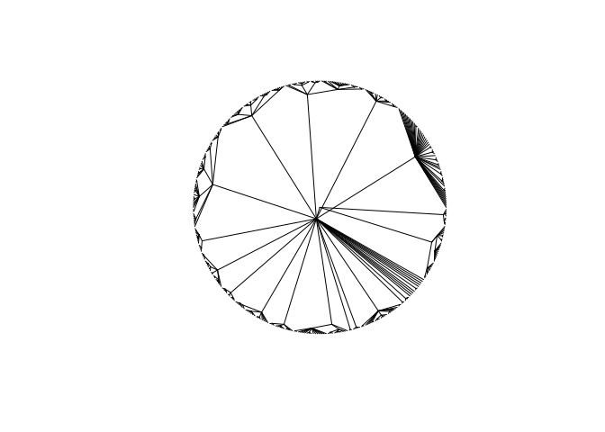

<!-- README.md is generated from README.Rmd. Please edit that file -->

# geotax

<!-- badges: start -->

[](https://github.com/alrobles/geotax/actions/workflows/R-CMD-check.yaml)
<!-- badges: end -->

geotax models the probability that two hosts share a pathogen (or any
symbiont) given their phylogenetic or taxonomic distance, following
[Robles-Fernández & Lira-Noriega
(2017)](https://doi.org/10.3389/fams.2017.00017).

## Installation

You can install the development version of geotax from
[GitHub](https://github.com/alrobles/geotax) with:

``` r
# install.packages("devtools")
devtools::install_github("alrobles/geotax")
```

## Workflow

The v2 API goes from an interaction table plus a host distance matrix to
a fitted host-sharing model:

1.  `prepare_taxonomic_tree()` — build a taxonomic tree from a rank
    table (or use any phylogeny, e.g. from [Fish Tree of
    Life](https://fishtreeoflife.org/)).
2.  `prepare_pair_data()` — expand an interaction table into all (focal
    host, target host) pairs per parasite. All known hosts are used as
    focal hosts, so the data set is deterministic.
3.  `compare_geotax_slopes()` / `cluster_bootstrap_geotax()` — fit
    logistic regressions of sharing probability on phylogenetic
    distance, with parasite-level cluster bootstrap uncertainty and
    formal between-clade slope comparison.

Legacy single-focal-host functions (`fit_geotax_model()`,
`bootstrap_geotax_model()`, and the deprecated
`get_log_reg_coefficients()` family) are kept for backward
compatibility.

## Example: taxonomic tree

Compute a taxonomic tree from a table with taxonomic ranks (bark beetle
hosts from the original paper):

``` r
library(geotax)
library(dplyr) ## this is for clean the data if need it
#> 
#> Attaching package: 'dplyr'
#> The following objects are masked from 'package:stats':
#> 
#>     filter, lag
#> The following objects are masked from 'package:base':
#> 
#>     intersect, setdiff, setequal, union
data("tax_table")
clean_tree <- distinct(tax_table)

# clean the data
taxonomic_tree <- geotax::get_taxonomical_tree(clean_tree, power = 1)
#> Warning: 'geotax::get_taxonomical_tree' is deprecated.
#> Use 'prepare_taxonomic_tree' instead.
#> See help("Deprecated")
plot(taxonomic_tree, type = "radial", show.tip.label = FALSE)
```



``` r
ape::cophenetic.phylo(taxonomic_tree)[1:5, 1:5]
#>                       Lysiloma latisiliquum Ormosia hosiei Cercis canadensis
#> Lysiloma latisiliquum             0.0000000      0.2857143         0.2857143
#> Ormosia hosiei                    0.2857143      0.0000000         0.2857143
#> Cercis canadensis                 0.2857143      0.2857143         0.0000000
#> Dialium guianense                 0.2857143      0.2857143         0.2857143
#> Vachellia pennatula               0.2857143      0.2857143         0.2857143
#>                       Dialium guianense Vachellia pennatula
#> Lysiloma latisiliquum         0.2857143           0.2857143
#> Ormosia hosiei                0.2857143           0.2857143
#> Cercis canadensis             0.2857143           0.2857143
#> Dialium guianense             0.0000000           0.2857143
#> Vachellia pennatula           0.2857143           0.0000000
```

## Example: pairwise host-sharing model

``` r
pairs <- prepare_pair_data(beetleTreeInteractions, phy_dist)
#> Warning in prepare_pair_data(beetleTreeInteractions, phy_dist): 22 interaction
#> record(s) dropped: host not in 'phydist'.
boot <- cluster_bootstrap_geotax(pairs, n_boot = 100, seed = 42)
boot
#> Geotax cluster bootstrap (100 replicates)
#>             estimate    2.5%   97.5%
#> (Intercept)  -1.0738 -1.6019 -0.7654
#> phydist      -0.0010 -0.0016 -0.0006
```

## Example: comparing clades

See the vignette `vignette("caligus-vs-lepeophtheirus")` for a full case
study comparing sea lice genera *Caligus* (generalist) and
*Lepeophtheirus* (specialist) on marine fishes, using interaction
records from the [cofid](https://github.com/alrobles/cofid) package and
the Fish Tree of Life phylogeny.
